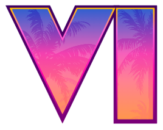

<div align="center">



# GTA VI — Canvas Designer
### Rockstar-inspired artwork studio in the browser

[](https://developer.mozilla.org/docs/Web/HTML)
[](#)
[](#)
[](http://fabricjs.com)
[](#license)
[](https://github.com/antojunimaia-ui/Grand-Theft-Auto-Designer)

**Create official GTA VI covers, logos, and posters — no Photoshop required.**

[Live Demo](#) • [Features](#features) • [Quick Start](#quick-start) • [Gallery](#gallery) • [Export](#export)

</div>

---

## ✨ Features

<table>
<tr>
<td width="50%">

**🎨 Typography Engine**
- `Brother-1816-Black` (official GTA VI) + `GTA Art Deco` + `Pricedown`
- 3 logo styles: `Colorful` / `Mono` / `Outline`
- Cover-Art stroke, palm-tree texture, 62° light reflex
- Letter-spacing, shadow & glow sliders, opacity/rotation

</td>
<td width="50%">

**🖼️ Canvas Studio**
- 1920×1080 (FHD) artboard with Fabric.js
- Drag, scale, rotate, reorder layers (drag & drop)
- 19 backgrounds, 24 characters (IV/V/VI), 10 palm assets
- Undo / Redo (50 steps), center, front/back, delete

</td>
</tr>
<tr>
<td>

**💾 Projects System**
- Save / Load from `localStorage` (order + positions preserved)
- Duplicate, delete, rename
- Export / Import `.json` for backup & sharing
- Thumbnail preview + background persisted

</td>
<td>

**📤 High-Res Export**
- `canvas.toDataURL` with `multiplier = 1/currentZoom` (true 1920×1080)
- CORS-safe loading (`data:` + `file:` vs `http` handling)
- Graceful fallback + toast guidance for `file://` tainted canvas

</td>
</tr>
</table>

---

## 🎮 Preview

> Open `index.html` and hit **`G`** for Gallery or **`PROJ`** (toolbar bottom) for Projects.

```
Toolbar:  SEL | LOGO | SUB | BG | GAL | DEL || PROJ
                                      ↑
                          Projects modal (save/load)

Canvas  ← 1920×1080  →   Controls: Size / Spacing / Opacity / Rotation / Shadow / Glow
Layers  ← drag ↕ to reorder, × to delete
Status  ← 1920×1080 | Layers: 3 | Zoom: - 100% + FIT  (now in status bar, not overlaying)
```

---

## 🚀 Quick Start

### Option 1 — Just open it
```bash
# Clone
git clone https://github.com/antojunimaia-ui/Grand-Theft-Auto-Designer.git
cd Grand-Theft-Auto-Designer

# Open
start index.html        # Windows
open index.html         # macOS
```

### Option 2 — Local server (recommended for Export)
`file://` blocks `toDataURL` (tainted canvas) for external images. Use HTTP:

```bash
# any of these
npx serve .
python -m http.server 8000
php -S localhost:8000
# VS Code → Live Server → Go Live
```
Then open `http://localhost:8000` or `http://localhost:3000`.

---

## 🎛️ Usage

| Action | How |
|---|---|
| **Add logo** | Click `LOGO` (or press `T`) → type in right panel → pick style (`Color/Mono/Outline`) |
| **Subtitle** | Click `SUB` → choose font (`Art Deco Medium/Regular`, `Pricedown`) + color |
| **Gallery** | `BG` / `GAL` or press `G` → 19 backgrounds, 24 characters, 10 palms |
| **Transform** | Select layer → drag, resize handles, sliders for size/spacing/opacity/rotation |
| **Effects** | Shadow (0-100) + Glow (0-100, white rim) |
| **Reorder** | Drag layer handle `⋮` in **Layers** list or `Front` / `Back` |
| **Projects** | Bottom toolbar `PROJ` → name it → `Save` → `Load` / `Duplicate` / `Export .json` |
| **Export PNG** | Header `⇩ Download PNG` (true FHD). On `file://` you'll get a helpful toast + fallback without background |
| **Shortcuts** | `V`=Select, `T`=Logo, `Del`=Delete, `Ctrl+Z`/`Ctrl+Y`, `G`=Gallery, `Ctrl+S`=Save project |

---

## 🗂️ Project Structure

```
/
├── index.html          # Shell: header, toolbar, canvas, right panel, modals
├── assets-data.js      # Base64 embedded palms & characters (avoids tainted on file://)
├── css/
│   ├── main.css        # Rockstar theme: header, toolbar, status bar, toast
│   ├── canvas.css      # Artboard + zoom controls (now in status bar, not overlay)
│   └── panel.css       # Right panel, sliders, layer list, modals, project cards
├── js/
│   ├── constants.js    # CANVAS_W/H, BG_LIST (16), ASSET_LIST (10), CHAR_LIST (24)
│   ├── renderer.js     # GTA VI shader: gradients, strokes, palm pattern, reflex
│   ├── canvas.js       # Fabric setup, zoom, create/update text, backgrounds, export
│   ├── history.js      # Undo/Redo (50)
│   ├── projects.js     # Save/load/dup/exp/imp — order-preserving slots
│   ├── ui.js           # Panel sync, sliders, drag & drop layers
│   └── app.js          # Font loading, gallery init, shortcuts, initial random text
├── backgrounds/        # 16 jpg/png
├── Characters/         # IV / V / VI png
├── assets/palms/       # 10 palm cutouts
└── Fonts/              # Brother-1816-Black.woff2, Art Deco, Pricedown
```

---

## 📸 Gallery & Assets

- **Backgrounds:** Jason & Lucia, Vice City, Port Gellhorn, Ambrosia, Grassrivers, Leonida Keys, Mt. Kalaga + character BGs
- **Characters:** `IV`: Niko, Roman — `V`: Franklin, Michael, Trevor — `VI`: Lucia & Jason (x5), Boobie, Brian, Cal, Dre’Quan, Raul, Real Dimez
- **Palms:** 5 color + 5 mono, filterable in modal

All images lazy-loaded; thumbnails use `object-fit:cover` with Rockstar cards.

---

## 💾 Projects — How saving works

```js
// serialized shape (localStorage: gta_vi_projects_v1)
{
  id: "lxyz...",
  name: "My Cover",
  background: "viceCity", // or transparent/black/dark
  objects: [
    { _isGTA:true, type:"logo", text:"VICE CITY", style:"colorful", fontSize:260, ... left, top, angle, scaleX, scaleY, opacity },
    { _isChar:true, file:"Characters/...", left, top, scaleX, scaleY, angle, opacity },
    { _isAsset:true, ... }
  ],
  thumbnail: "data:image/png;base64,..." // ~12% scale, null if tainted
}
```

Order is preserved via **slot array** (`new Array(n)`) — async `fabric.Image.fromURL` results are stored at original index and only `canvas.add()`'ed sequentially + `moveTo(idx)`. Fixes the classic async z-index bug.

---

## 📤 Export & CORS Gotcha

- **Why `file://` fails:** Chrome treats each `file://` as unique origin. Any external `file://` image taints the canvas → `toDataURL` throws `SecurityError`.
- **Fix:** 
  - Palm textures & some characters are embedded as `data:` (via `assets-data.js`).
  - `getFabricLoadOptions(src)` → `null` on `file:` / `data:` else `{crossOrigin:'anonymous'}`.
  - `exportPNG()` catches `SecurityError` → toast *“open via local server (npx serve / Live Server)”* and tries fallback without background.

> **Tip:** Always serve over HTTP for full-res export.

---

## ⌨️ Shortcuts

```
T  Add logo
V  Select tool
G  Gallery
Del / Backspace  Delete layer
Ctrl+Z / Ctrl+Y  Undo / Redo
Ctrl+S           Save project (when modal open) / Open projects
Esc              Deselect / Close modal
Arrows           Nudge 2px (Shift = 15px)
```

---

## 🛠️ Tech Stack

- **Fabric.js** (canvas) — object model, selection, serialization
- **Vanilla JS** — no build step, just `index.html`
- **CSS** — Rockstar-inspired blur, gradients, pill buttons, dark glass panels
- **localStorage** for projects, `Blob` for JSON import/export

---

## 🤝 Contributing

PRs welcome! Keep it vanilla (no framework) and preserve the Rockstar aesthetic.

```bash
git checkout -b feat/my-feature
# ... code
git commit -m "feat: my feature"
git push origin feat/my-feature
```

---

## 📄 License

MIT — do whatever you want, just keep the credit.

---

<div align="center">

**Built for the VI era. 🌴**

`1920×1080` • `Brother-1816-Black` • `Soft-Light Palms` • `Destination: Vice City`

[⬆ Back to top](#gta-vi--canvas-designer)

</div>
